# Django Research - Group A

## References
- [What is Django?](#what-is-django)
- [Why use Django?](#why-use-django)
- [Key benefits of Django](#key-benefits-of-django)
- [Djangos Popularity](#djangos-popularity)
- [Resources and Capabilities of Django](#resources-and-capabilities-of-django)
- [Security](#security)
- [Important Features of Django](#important-features-of-django)
- [Drawbacks of Django](#drawbacks-of-django)
- [Companies who have used Django](#companies-who-have-used-django)
- [Django vs. Flask](#django-vs-flask)
- [Django vs. Node.js](#django-vs-nodejs)
- [How to install Django](#how-to-install-django)
- [Django Webpage and Django Game](#django-webpage-and-django-game)
- [Code Snippets](#code-snippets)
- [Conclusion](#conclusion)
- [Thank You](#thank-you)
- [Tutorial on Django](#tutorial-on-django)
- [Prerequisites](#prerequisites)
---

## Django Presentation


## What is Django?

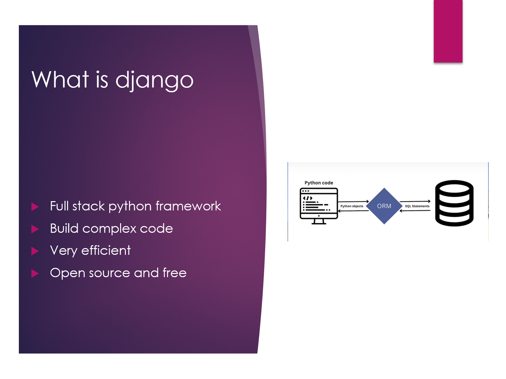
Django is a high-level Python web framework that encourages rapid development and clean, pragmatic design. It is intended to enable developers to quickly construct, scalable, and secure web applications. Django follows MTV (Model-View-Template) architectural patterns. Thus, it is very easy to separate the data layer (model) from the user interface (template) and business logic (view).

Django has built-in ORM (Object-Relational Mapper) for handling databases, an admin panel for handling content, out-of-the-box permission and authentication support, and form handling, URL routing, amongst many other tools. It stresses a lot on security, so protection against the common web vulnerabilities like SQL injection, cross-site scripting (XSS), and cross-site request forgery (CSRF) is there.

## Why use Django?

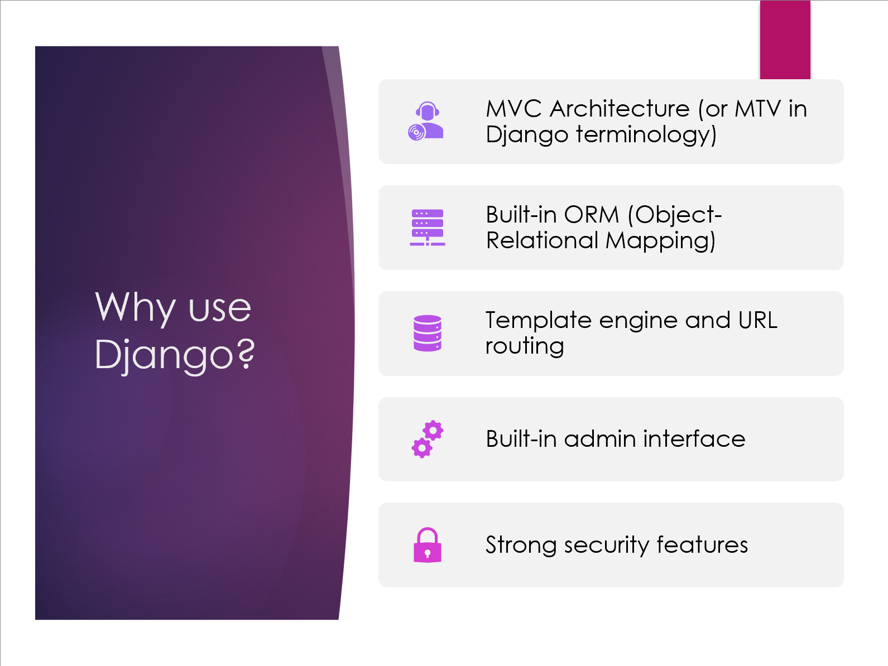
- **MVT Architecture**: Django follows the Model-View-Template (MVT) pattern which allows for the code to be organized efficiently. In Django, the model represent the data and logic. The view describes how the request is processed and how the reponse will be return. The template takes care of the HTMLs. This separation makes Django applications modular and easier to maintain.
- **Built-in ORM (Object-Relational Mapping)**: Django's ORM allows the programmer to communicate with the database through Python instead of SQL. It provides an abstraction layer on top of the database; manipulating it directly is thus easier and even safer. Meanwhile, it supports many databases like PostgreSQL, MySQL, SQLite, and Oracle.
- **Template Engine and URL Routing**: Django provides a strong template engine for dynamically creating HTML that supports reusable components out of the box. The URL routing system allows developers to map URLs to views with ease and makes URL management easier and customizable.
- **Built-in Admin Interface**: Django itself creates an administration interface that manages the data which is highly customizable. An administrator will then be able to perform CRUD (create, read, update and delete) via the Web interface without extra coding hence saving development time.
- **Strong Security Feature**: Django emphasizes security a lot. Security against common web attacks, such as SQL injection, cross-site scripting (XSS) and cross-site request forgery (CSRF), is implemented. It also allows by default some good practices which will make your application a bit more robust in security terms.

These features make Django a popular choice for developers who want to build secure, maintainable, and scalable web applications efficiently.
## Key Benefits of Django
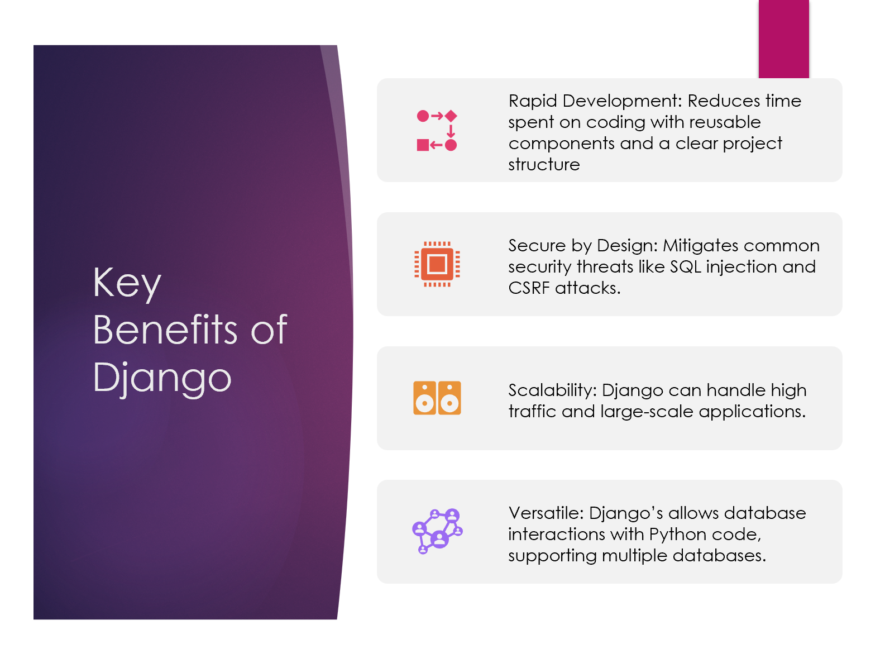
- **Rapid Development**: Fundamentally, the core of Django allows the developer to cut down the development time by reusing code components, proper project structure, and a large number of behind-the-scenes modules. Thus, more time will be spent on the creative part rather than the repetitions.
- **Secure by Design**: Django is designed with security in mind. It tries to help developers eliminate common web vulnerabilities like SQL injection, cross-site scripting (XXS), or cross-site request forgery (CSRF). With Django, developers can take advantage of its prebuilt security features, guided by the best practices for security.
- **Scalability**: Django is built for large-scale applications and can handle high traffic loads efficiently. The architecture in Django was such that the component-based design makes it very suitable for smaller projects, too, as for complex applications with considerable traffic.
- **Versatile**: Django can use several database back-ends and is extremely friendly to a Python coder hence it will be easy to shift to another database if needed. Such versatility allows Django to be applied both for a content management system and a scientific computation platform.

These benefits make Django a robust choice for developers aiming to build scalable, secure, and adaptable web applications.
## Djangos Popularity
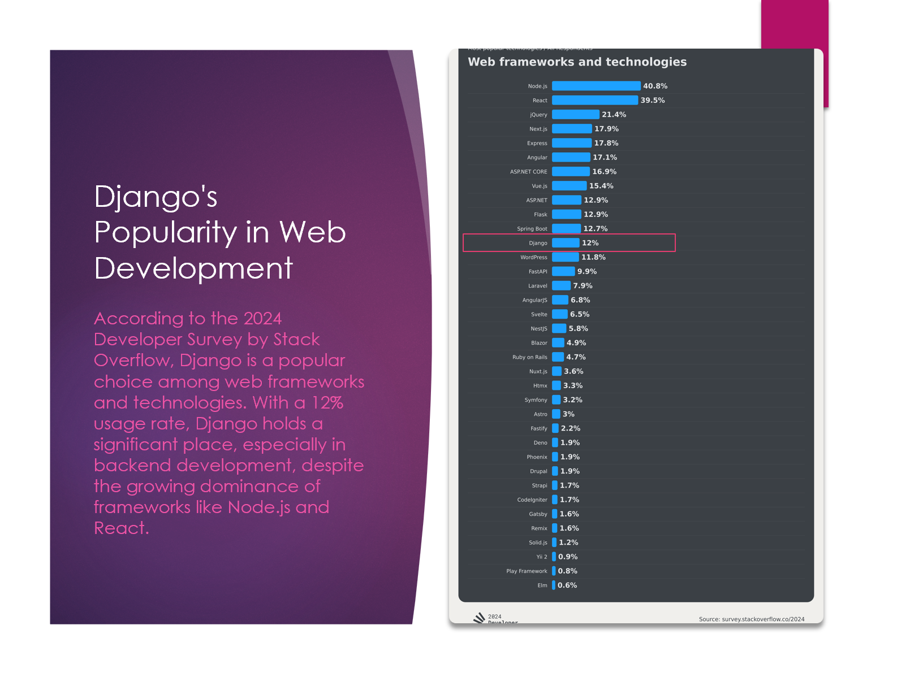
In the 2024 Developer Survey by Stack Overflow, Django retains a place right in the middle of other web frameworks and technologies, holding a sizeable 12% usage rate. That makes Django one of the leading ones in web development, especially in back-end development. Its stable position, however, keeps it from falling down the list for its power, security, and adaptability. This continues to prove relevant and useful to developers who want to use a powerful, documented, community-supported system of frameworks to create large-scale Web applications.
## Resources and Capabilities of Django
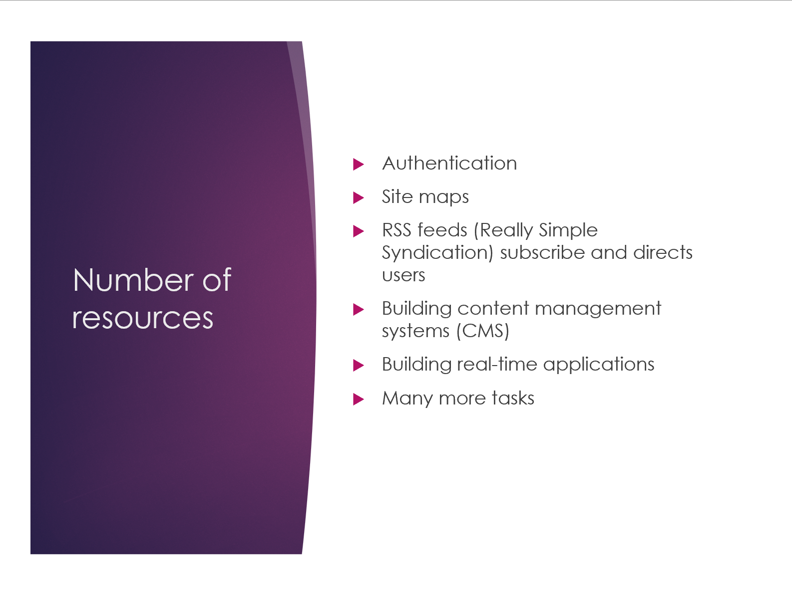
- **Authentication**: Django boasts of a high-feature authentication-and-permission system that makes user account, session, and permission management so easy; this surely counts among those features that immediately become indispensable while developing applications requiring user log-ins and other related access controls.
- **Site Maps**: Django supports site maps out of the box: XML files that give search engines hints about the structure of your site and improve your SEO (Search Engine Optimization) - making sure people see the correct indexing of your content.
- **RSS Feeds (Really Simple Syndication)**: Django provides tools for constructing RSS feeds, which enable subscribers to receive instant updates when the publishers add fresh content. This is particularly useful for content-heavy applications such as blogs or news sites.
- **Building Content Management Systems (CMS)**: As Django is modular and flexible, it is the most appropriate framework for developing customized content management systems, where the administration can edit site contents without having to code.
- **Building Real-Time Applications**: Django will enable real-time applications by integrating other frameworks that support features like WebSockets and allow for asynchronous communication; hence, it is suitable for implementation in chat applications or live notifications.

These resources make Django a powerful framework for developers who need comprehensive tools to build and manage complex web applications.
## Security
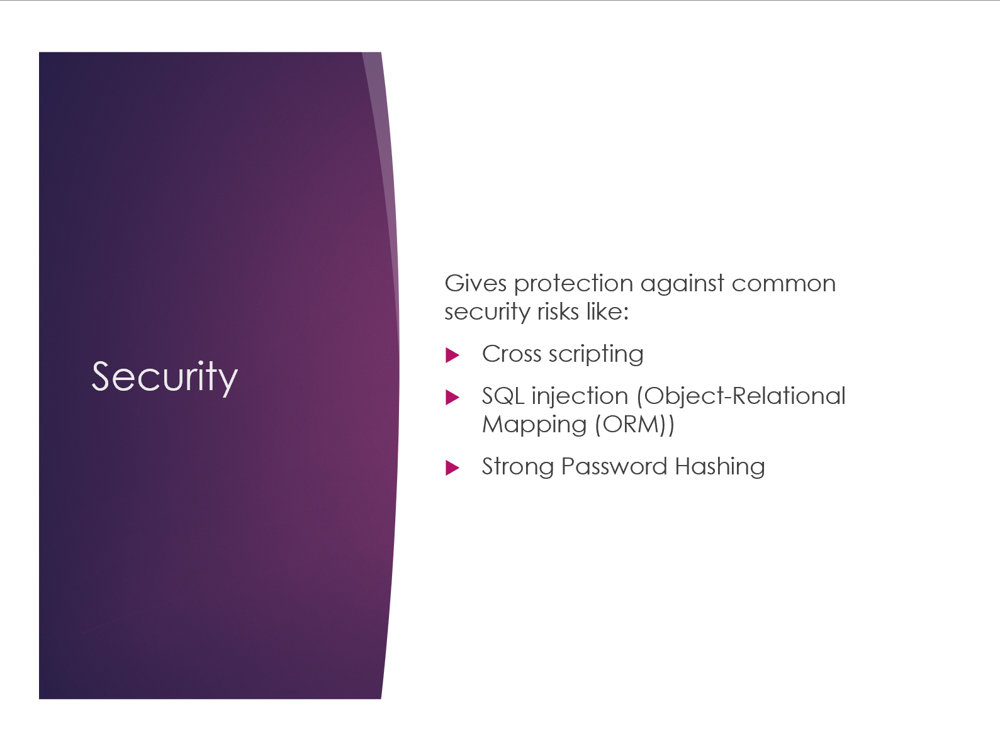
- **Cross-Site Scripting (XSS) Protecting**: Django provides built-in protections against cross-site scripting (XSS) attacks, where malicious scripts are injected into web pages viewed by other users. Django’s template system automatically escapes input data, helping to prevent these types of attacks and ensuring that user-generated content is handled securely.
- **SQL Injection Protection (Object-Relational Mapping - ORM)**: Django's ORM allows the developer to interact with the database by writing Python code, thus reducing the possibility of SQL injection vulnerabilities by a big margin. Django's ORM prevents bad SQL command execution by an attacker via its usage of parameterized queries and encapsulation of raw SQL.
- **Strong Password Hashing**: Django comes with a very strong password hashing engine that stores passwords very securely. Django uses algorithms like PBKDF2 (
PBKDF2, or Password-Based Key Derivation Function 2) out of the box, while the configuration for even stronger algorithms is available, should this ever be required. This makes the retrieval of actual passwords quite impossible for attackers if an attacker succeeds in accessing the database.

These security features make Django a secure framework choice, as it is designed to protect applications against common web vulnerabilities and promote secure coding practices.
## Important Features of Django
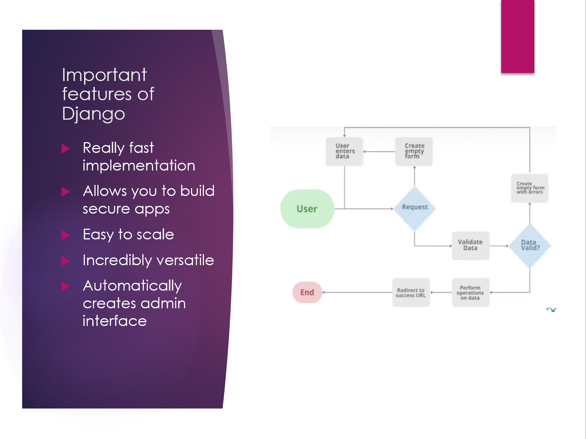
- **Really Fast Implementation**: Django is designed in a modular fashion for rapid development. It provides the developer with batteries-included tools that allow rapid feature implementation without code duplication, hence ideal for projects that have to be done in the shortest time.
- **Allows You to Build Secure Apps**: Django takes into consideration security concerns seriously and provides some built-in protection for common vulnerabilities: it offers authentication, prevents SQL injection, and protects against XSS attacks, among others, mostly out of the box.
- **Easy to Scale**: The architecture of Django is scaled easily, due to which it fits in both small and big applications. Its flexibility and the support of different database backends and caching solutions make Django applications scalable with growing demands.
- **Incredibly Versatile**: Everything from simple websites to complex enterprise-level solutions can be developed with Django. That makes Django flexible, because there is a great ecosystem of libraries and plugins for almost any need.
- **Automatically Creates Admin Interface**: Some of the powerful features included in Django are the ready-wear admin interface; this saves a lot of time and other resources since the developers will not be bothering themselves building up any admin system. It's also highly customizable, mainly for different applications.

These features make Django a powerful and efficient framework, ideal for building secure, scalable, and versatile applications.
## Drawbacks of Django
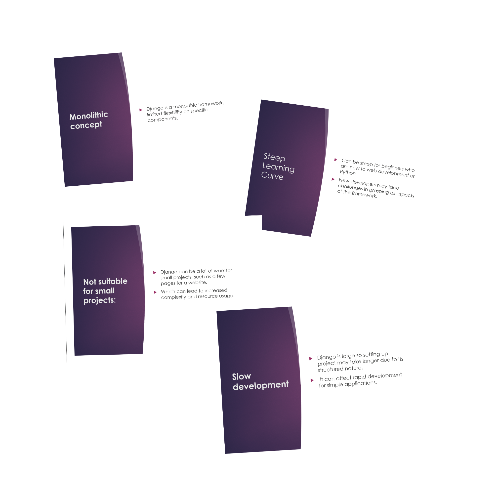
- **Monolitihic Concept**: Well, Django is a monolithic framework, meaning it is all in one and tightly integrated. In such a design, while a lot can be brought under one roof, there is limited flexibility in case they really want to customize or swap in other parts. In some ways, it may not be the best fit for microservices-based systems, in which a structure built from independent, loosely coupled components is preferred.
- **Steep Learning Curve**: Django is quite overwhelming for a beginner, especially if they are absolutely new-both to web development and even Python. Since Django is structured and opinionated, it takes quite a while to learn models, views, templates, and middleware. New developers cannot take in all those aspects, so the learning curve is steep initially.
- **Not Suitable for Small Projects**: Django's feature set is much too big for a small project. For those applications where there are only a few pages or basic functionality, the setup which Django does is just unnecessary and resource-consuming. In such light projects, one can use smaller frameworks or even microframeworks, like Flask.
- **Slow Development for Simple Applications**: Due to its structured nature and big size, setting a Django project is time-consuming and, therefore, affects the pace of development for smaller applications. While it's one of the best frameworks for big and complex projects, structure and setup time impede rapid development when creating quick minimal apps.

These points highlight some of Django’s limitations, particularly when flexibility, simplicity, or quick setup is needed for smaller or simpler applications.
## Companies who have used Django
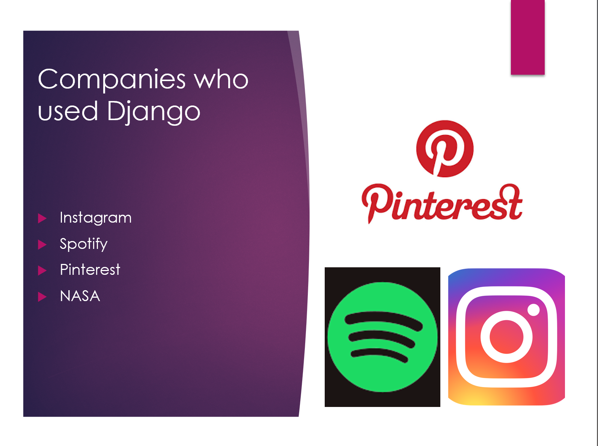
- **Instagram**: Instagram had chosen Django to develop its web application for the first time because Django had the advantage of fast development and was scalable. Hence, Django enabled Instagram to handle high traffic and rapidly deploy new features as the site was scaling up, making it very apt an excellent choice for a social networking site with hundreds of millions of users.
- **Spotify**: Spotify relies on Django for the complete backend of the web application, as it's handier to work with complex data and gives good interoperability with other systems. It scales and is flexible enough to handle a great quantity of information with intensive user interactions.
- **Pinterest**: Pinterest used Django when it was starting, which had the advantage of quickly setting up with a solid framework. For instance, Django allowed Pinterest to grow rapidly by handling millions of active users who can upload images and interact with other users in numerous ways.
- **NASA**: NASA has used Django in some internal projects, relying on safety features and the capability of Django to handle very complicated data structures. Stability and robustness make Django suitable for mission-critical applications where reliability is crucial.

These examples highlight Django’s versatility and scalability, making it a popular choice among high-profile companies for building complex and secure applications.
## Django vs. Flask 
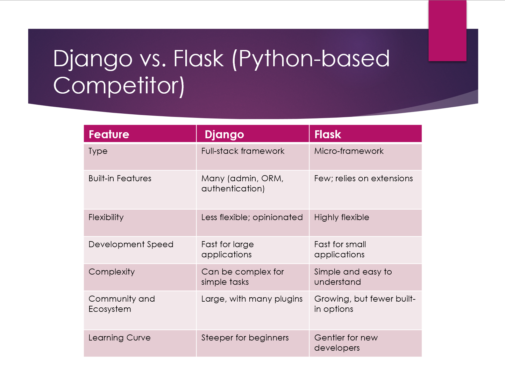
1. Type: 
    - Django: A full-stack framework, meaning it provides a complete set of tools and components to build complex web applications out of the box.
    - Flask: A micro-framework, offering a lightweight and minimal approach, allowing developers to add extensions as needed.
2. Built-in Feature:
    - Django: Comes with many built-in features like an admin interface, ORM, and authentication system, making it suitable for large applications with complex requirements.
    - Flask: Offers minimal built-in functionality, relying on extensions for features like authentication and ORM, giving developers more control over components.
3. Flexibility: 
    - Django: Less flexible due to its "batteries-included" philosophy and opinionated structure, which may restrict customization.
    - Flask: Highly flexible, allowing developers to choose and integrate components as they wish, making it ideal for custom setups.
4. Development Speed:
    - Django: Fast for large applications due to its comprehensive features and tools, enabling quicker implementation of complex functionality.
    - Flask: Fast for small applications, as it has minimal setup and allows rapid development for simple projects.
5. Complexity: 
    - Django: Can be complex for small tasks due to its structured and feature-rich design, which might be overwhelming for simple projects.
    - Flask: Simple and easy to understand, making it more accessible for small projects and straightforward applications.
6. Community and Ecosystem:
    - Django: Has a large community with many plugins and resources available, making it easier to find support and extend functionality.
    - Flask: Has a growing community, but fewer built-in options and plugins, though it’s gaining popularity due to its simplicity and flexibility.
7. Learning Curve:
    - Django: Has a steeper learning curve, especially for beginners, due to its structured approach and multiple built-in components.
    - Flask: Gentler for new developers, as it is more straightforward and requires less knowledge of complex components.

In summary, Django is ideal for larger, more complex projects that require a robust framework with built-in tools, while Flask is better suited for smaller, simpler projects or when greater flexibility is desired.
## Django vs. Node.js
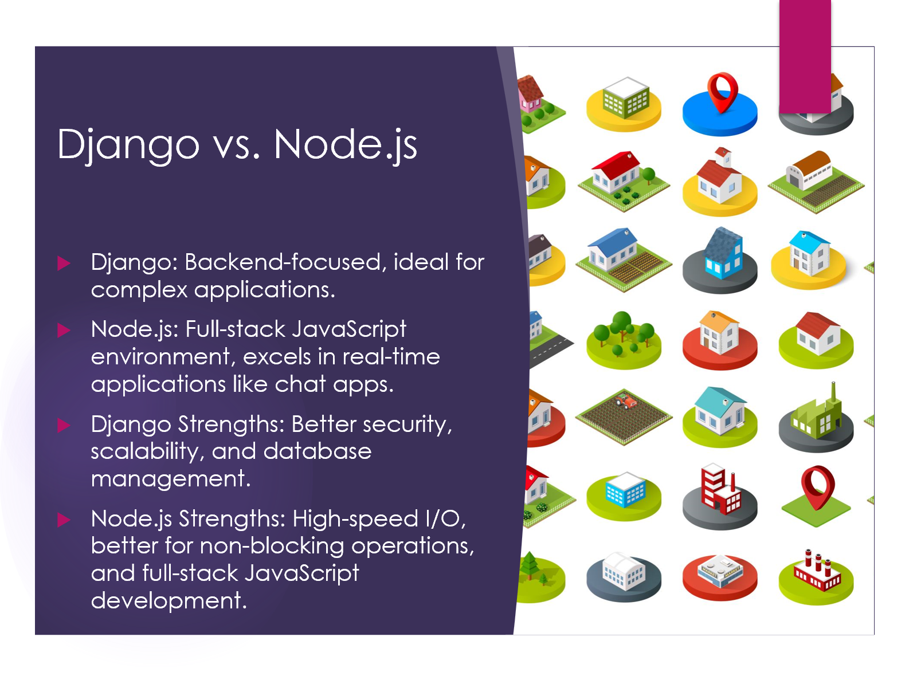
1. Django: Django is a backend-focused framework that is well-suited for building complex applications. Written in Python, Django provides a structured and secure environment, which makes it an excellent choice for applications that require reliable data management, robust authentication, and complex backend functionality.
2. Node.js: Node.js is a JavaScript runtime that allows for full-stack development in a single language (JavaScript). It excels in handling real-time applications, like chat apps or collaborative tools, thanks to its non-blocking, event-driven architecture, which enables efficient handling of concurrent connections.
3. Django Strengths:
    - Security: Django has strong built-in security features to protect against common vulnerabilities, making it a secure choice for backend development.
    - Scalability: Django’s structure and modular components allow for easy scaling, making it suitable for large-scale applications.
    - Database Management: Django’s ORM and data management tools simplify interactions with databases, providing a reliable layer for managing complex data relationships.
4. Node.js Strengths:
    - High-speed I/O: Node.js’s non-blocking I/O operations make it highly efficient for handling multiple requests simultaneously, enhancing performance for data-intensive applications.
    - Non-blocking Operations: This architecture is ideal for applications requiring real-time interactions, such as chat or streaming applications, where quick response times are essential.
    - Full-stack JavaScript Development: Node.js allows developers to use JavaScript for both frontend and backend, creating a unified development environment that simplifies project management and code sharing.

In summary, Django is better suited for secure, complex applications that rely on structured backend logic, while Node.js shines in real-time applications and environments that benefit from a full-stack JavaScript solution.
## How to install Django
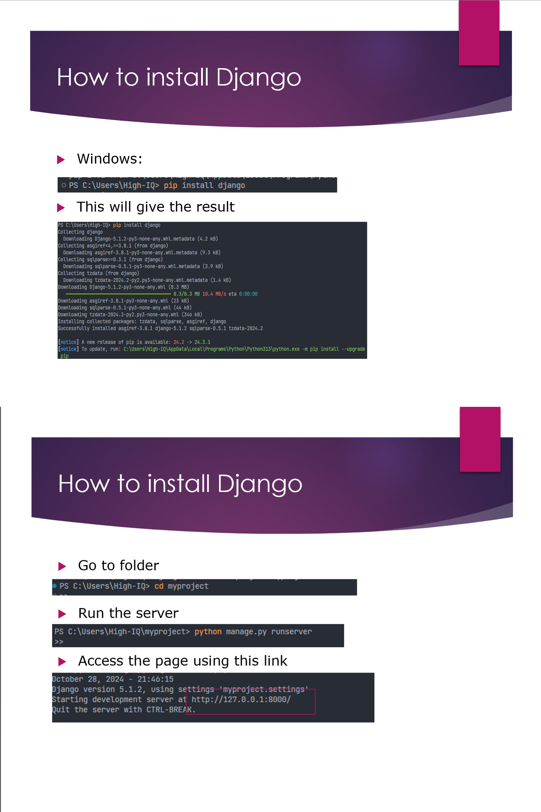
1. How to install Django on Windows:
    - Firstly open the command prompts and run the command ```pip install django```. This will use the Python package, ```pip```, to download and install the latest version of Django.
    -  Once the installation starts, you’ll see it downloading Django and its dependencies (like ```asgiref```, ```sqlparse```, etc.). After successful installation, you’ll get a confirmation message indicating Django has been installed.
2. Setting up and Running a Django Project:
    - Navigate to the Project Folder: Use the command ```cd 'nameOfProject'``` to go to the directory where your Django project is stored.
    - Run the Server: Run the command ```python manage.py runserver``` to start the Django server. This server will allow you to test the app locally.
    - Access the page: Once the server is up and running, Django will provide a local URL which is usually ```http://127.0.0.1:8000/``` that you can visit in a web browser of your choice to view your project. This URl allows for you to check if Django is working correctly and to view any changes that you make during development.

These steps provide a quick way to install Django, set up a new project, and test it in a local development environment.
## Django Webpage and Django Game
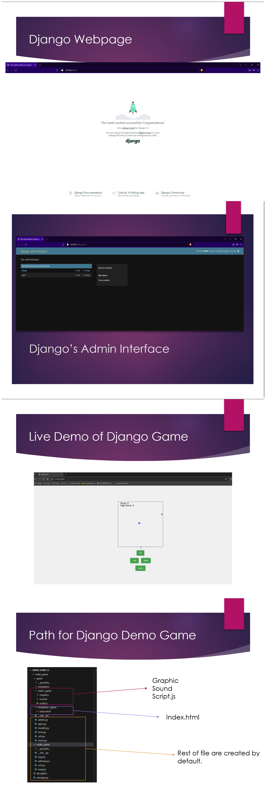
1. Django Webpage:
    - The first slide shows the defaut Django welcome page that appears after a successful installation and setup. When you navigate to the URl ```http://127.0.0.1:8000/```, this page confirms that you have install Django correctly and the server is up and running.
2. Django Admin Interface:
    - As said before, Django comes built-in with a powerful admin interface which is accessible at ```http://127.0.0.1:8000/admin/```. This slide displays the admin dashboard, which is where administrators can manage data, users and permissions. the interface is automatically generated and is also customizable, saving development time for backend management.
3. Live Demo of Django Game: 
    - The third slide shows a live demo of a simple snake game created with Django. It demostrates Django's versatility in handling dynamic, interactive content using HTML and Django's backend capabilities.
4. Path for the Django Snake Game:
    - The final slide displays the folder structure for the snake game, showing important directories like ```static``` (for assets such as graphics, sounds, and scripts) and ```templates``` (for HTML files). This organization illustrates how Django projects are structured, with predefined locations for static files and templates, and essential Django files created by default (e.g., ```settings.py```, ```urls.py```).
## Code Snippets
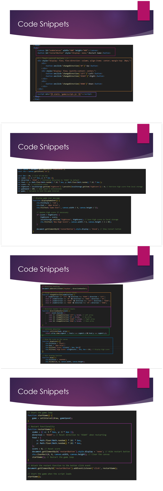
1. HTML Structure and Control Buttons:
    - First code snippet shows the HTML strucutre for the game. It includes a ```<canvas>``` element (```snakeCanvas```) where the game will be rendered, a hidden 'Restart Game' button and a control panel with buttons to change the direction of the snake (Up, Down, Left, Right).
    - The JavaScript file (```script.js```) is linked right at the end, where the game logic is implemented.
2.  Game Initialisation and Variables:
    - In the second slide, the first snippet of code initialises the essential game variables, including the canvas context (```ctx```), the snakes initial position and direction, and the food's random position.
    - It also sets up other important variables like ```score```, ```highScore``` (stored in local storage), ```gameSpeed``` (controls the snake’s speed), and ```game``` (to hold the game loop interval).
3. Game Logic Functions: 
    - The third slide shows code that include the functions to handle game controls and logic:
        - ```changeDirection(newDirection)```: Changes the direction of the snake based on user input.
        - ```directionHandler(event)```: Maps keyboard arrow kets to change the snakes's direction.
        - ```collision(head, array)```: Checks for collision with the snakes body.
        - ```drawScore()```: Displays the current and high score on the canvas.
        - ```draw()```: The main function that draws the game state, including the snake and food.
4. Game Loop and Restart Functionality:
    - ```startGame()```: Starts the game loop, which updates the game state at a set interval.
    - ```restartGame()```: Resets the game by reinitializing variables like the snake's position and score, clearing the canvas, and restarting the game loop.
    - Finally, the restart button is linked to the ```restartGame``` function, allowing for the game to be reset when clicked.

These snippets collectively define the core structure and logic for a simple JavaScript-based snake game, with directional controls, scoring, and restart functionality.
## Conclusion
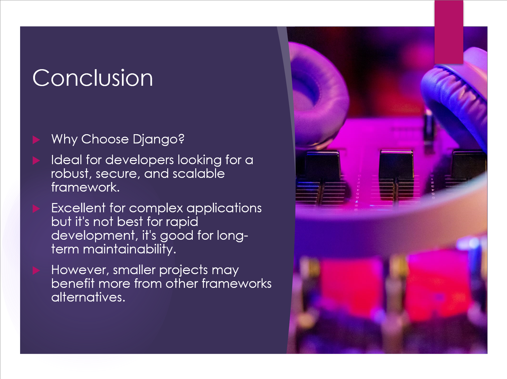
- Why Choose Django?: Django is ideal for developers seeking a robust, secure, and scalable framework.
- Ideal for Complex Applications: Django excels at handling complex applications that require a strong backend with built-in security and scalability. It's well-suited for projects that benefit from long-term maintainability.
- Not the Best for Rapid Development: While Django is powerful, it may not be the quickest option for simple applications or rapid development due to its structured and feature-rich nature.
- Better Alternatives for Smaller Projects: For smaller or less complex projects, other lightweight frameworks may be more appropriate, offering quicker setup and flexibility.

In summary, Django is a great choice for large, secure, and scalable applications, though simpler frameworks may be preferable for smaller projects.
## Thank You
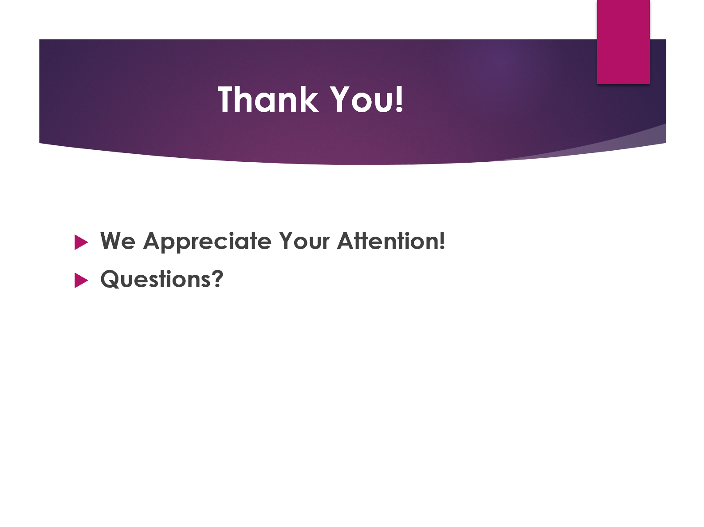
---

# Tutorial on Django


In this documentation, I will give a step-by-step tutorial on installing and setting up Django, along with some prerequisites and basic information.

## Prerequisites

1. Python: Django is a Python web framework, so you’ll need Python installed on your machine. Django supports Python 3.8 and later.
    - To check if you have python installed, open terminal and type: ```python --version```.
    - If python is not installed, you can download it from the [official Python website.](https://www.python.org/downloads/)
2. Pip: Pip is Python's package manager and is usually included with Python installations. You'll use it to install Django and other dependencies.
    - To check if pip is installed, in terminal type ```pip --version```